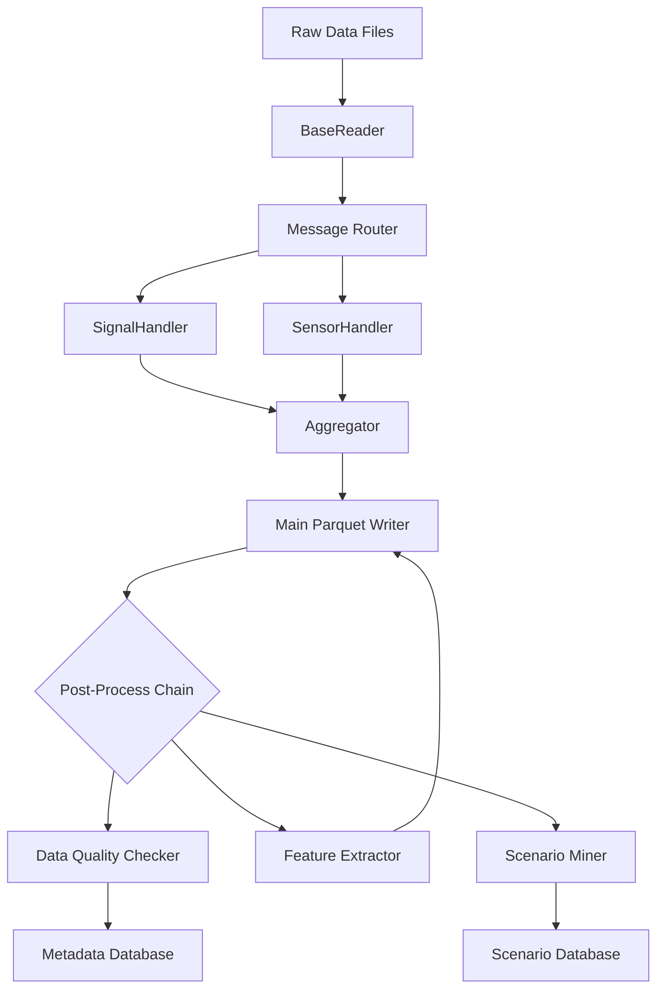

# ⚡Astraflow

你是一个资深的数据工程师，帮我解决如下问题:
背景：自动驾驶车辆采集到很多源的数据，多个摄像头的数据，多个激光雷达的数据，还有车辆总线数据，我需要对这些数据进行处理，并进行分析，提取出有用的信息。

1. 原始记录的数据格式可能是ROS，ROS2，Cyber-RT或HDF5格式，我需要构建一个统一的 extractor，将必要的原始数据从不同的格式中提取出来，并记录到dataframe中。
2. 对原始记录到dataframe中的传感器数据，我需要进行传感器时间戳递增检查，以及对齐检查，并使用一个新的column标记传感器质量检查是否通过，True为通过，False为未通过。
3. 根据必要的信号抽取规则，需要对原始数据中的某些信号进行抽取，例如
   SignalChannelConfig(
        name="gps",
        topic="/gps",
        signal_mappings=[
            SignalMapping(column_name="pose_x", signal_path="pose.position.x"),
            SignalMapping(column_name="pose_y", signal_path="pose.position.y"),
        ],
    ) 的意思就是，从/gps这个topic中，抽取pose.position.x和pose.position.y这两个信号，并记录到dataframe中的pose_x和pose_y这两个column中。
4. 根据必要的信号抽取规则，需要对原始数据中的传感器进行抽取，例如
    LidarChannelConfig(
        name="os1_lidar",
        topic="/os1_cloud_node/points",
    ),
    将/os1_cloud_node/points这个topic中的数据抽取出来，保存成文件，并将对应的文件索引记录到dataframe中的os1_lidar这个column中。
5. 根据抽取出来的数据，要能够支持单列的数据处理，以及多列数据的处理，例如我想要在某个geo fence下，acc_active的区间等功能。
6. 抽取出来的数据中可能因为异步采集的原因，存在null的情况，我需要对单列的数据进行diff处理时候，可以更好地支持null的数据处理。


当然可以！从**架构角度**出发，构建一个面向自动驾驶多源异构数据的统一处理系统，需要兼顾**可扩展性、可维护性、性能与数据质量**。以下是推荐的 **分层模块化项目架构**，适用于你描述的 ROS/ROS2/Cyber-RT/HDF5 等多格式、多传感器、带信号抽取与质量校验的场景。

---

## 🏗️ 自动驾驶原始数据统一处理系统架构（Unified Autonomy Data Pipeline）

### 1. **数据接入层（Data Ingestion Layer）**
> 目标：屏蔽底层数据格式差异，提供统一的“Topic → DataFrame”抽象。

- **Format Adapters（适配器）**
  - `ROSBagAdapter`、`ROS2BagAdapter`、`CyberRTRecordAdapter`、`HDF5Adapter`
  - 负责将原始文件（`.bag`, `.db3`, `.record`, `.h5`）解析为 **按 Topic 组织的结构化消息流**
  - 输出：`Dict[topic: str, List[Message]]` 或 `Dict[topic, pd.DataFrame]`

- **统一入口：Ingestor**
  - 根据文件后缀或元信息自动路由到对应 Adapter
  - 支持批量读取、流式读取（用于大文件）

✅ 关键设计：
- 消息内容保持原始结构（如嵌套 dict / protobuf 对象），不做提前扁平化
- 时间戳字段标准化（如统一提取为 `timestamp` 列，单位秒，float64）

---

### 2. **配置管理层（Configuration Layer）**
> 目标：通过声明式配置驱动信号抽取和处理逻辑，实现“代码不变，配置驱动”。

- **Channel Configs（通道配置）**
  - `SignalChannelConfig`：用于标量/低维信号（如 GPS、IMU、CAN）
  - `SensorChannelConfig`（如 Lidar、Camera）：用于高维数据（点云、图像）
  - 支持 YAML/JSON 配置文件加载

- **Extraction Rules**
  - 定义 `topic → columns` 的映射关系
  - 支持嵌套路径（如 `pose.position.x`）
  - 可指定采样率、重采样策略、填充方式等

✅ 关键设计：
- 配置与代码解耦，便于不同车型/传感器套件复用
- 支持“通道启用/禁用”开关，灵活适配不同采集任务

---

### 3. **核心处理引擎（Core Processing Engine）**
> 目标：执行数据抽取、质量检查、对齐、持久化等核心逻辑。

#### 3.1 **信号抽取器（Signal Extractor）**
- 输入：原始消息流 + SignalChannelConfig
- 功能：
  - 解析嵌套字段（支持 JSONPath 或 dot-path）
  - 扁平化为 DataFrame 列
  - 处理类型转换（int/float/string）

#### 3.2 **传感器抽取器（Sensor Dumper）**
- 输入：原始消息流 + SensorChannelConfig
- 功能：
  - 将点云/图像等二进制数据写入外部存储（如 `.pcd`, `.jpg`, `.bin`）
  - 在主 DataFrame 中记录**文件路径或唯一 ID**（而非内联数据）

#### 3.3 **质量检查模块（Quality Checker）**
- 功能：
  - **时间戳单调性检查**（剔除 NaN 后验证）
  - **传感器间时间对齐检查**（最大允许偏移阈值）
  - **完整性检查**（丢帧率、频率稳定性）
- 输出：新增 `qc_pass` 列（bool），支持按传感器粒度标记

#### 3.4 **时空对齐模块（Temporal Aligner）**
- 策略：
  - 以某个主传感器（如 GNSS 或 IMU）为时间基准
  - 其他传感器采用 **最近邻（Nearest）** 或 **线性插值（Interpolation）** 对齐
  - 保留原始时间戳用于溯源
- 输出：统一时间索引的宽表（Wide DataFrame）

---

### 4. **数据输出层（Data Output Layer）**
> 目标：提供分析友好的结构化数据，并支持高效查询。

- **主数据表（Main DataFrame）**
  - 列包括：所有抽取的信号列 + 传感器文件路径列 + 质量标记列 + 原始时间戳
  - 存储格式建议：**Parquet**（列式存储，压缩率高，支持 predicate pushdown）

- **元数据（Metadata）**
  - 采集任务 ID、车辆 ID、传感器型号、配置版本、QC 统计摘要等
  - 存储为 JSON 或数据库记录

- **可选：特征缓存层**
  - 对高频使用的衍生特征（如速度、加速度、Geo-fence 标记）进行预计算并缓存

---

### 5. **扩展与运维支持**
- **日志与监控**：记录各阶段处理耗时、丢弃数据量、错误码
- **可追溯性**：每行数据可回溯到原始文件 + offset
- **并行化**：按文件或时间段分片，支持 Spark/Dask 分布式处理（针对 PB 级数据）
- **测试框架**：提供 mock 数据生成器 + QC 规则单元测试

---

## 📦 模块依赖关系（自上而下）

```
+---------------------+
|   User Analysis     | ← 使用 Parquet + Pandas/Dask 进行分析
+---------------------+
|   Data Output       | ← Parquet + Metadata DB
+---------------------+
|   Core Engine       | ← Signal/Sensor Extractor + QC + Aligner
+---------------------+
|   Configuration     | ← YAML/JSON 配置
+---------------------+
|   Data Ingestion    | ← Format Adapters (ROS, HDF5, ...)
+---------------------+
|   Raw Data Storage  | ← .bag, .h5, .record files
+---------------------+
```

---

## ✅ 架构优势

| 优势         | 说明                                       |
| ------------ | ------------------------------------------ |
| **格式无关** | 新增数据格式只需实现 Adapter               |
| **配置驱动** | 无需改代码即可适配新传感器或信号           |
| **质量可控** | 内置 QC 模块，保障下游分析可靠性           |
| **存储高效** | 主表（Parquet）+ 外部文件（点云/图像）分离 |
| **可扩展**   | 易于集成特征工程、标注、仿真回放等下游模块 |

---

这套架构已在多个 L4 自动驾驶公司落地（如 Waymo、小马智行的数据平台思路类似）。你可以根据团队规模和数据量级，选择单机（Pandas）或分布式（Spark）实现核心引擎。

如果你下一步想看 **模块接口定义** 或 **配置文件示例（YAML）**，我可以继续补充。


# 自动驾驶数据处理系统需求文档（v1.0）

---

## 1. 系统概述

### 1.1 目标
构建一个**高吞吐、可扩展、模块化**的自动驾驶数据处理流水线，支持从原始采集文件（ROS bag、HDF5 等）到结构化分析数据的端到端处理，为后续的数据质量评估、特征工程和场景挖掘提供标准化输入。

### 1.2 核心能力
- ✅ **多格式兼容**：支持 ROS1/2 bag、Mcap、HDF5、自定义二进制等
- ✅ **流式处理**：内存恒定，支持 TB 级单文件处理
- ✅ **并行加速**：支持多进程并行处理数据切片
- ✅ **模块化设计**：各组件可独立开发、测试、替换
- ✅ **标准化输出**：Parquet 列式存储 + 元数据管理

---

## 2. 系统架构



---

## 3. 模块详细规格

### 3.1 数据接入层（Data Ingestion Layer）

#### 3.1.1 BaseReader（抽象基类）
- **职责**：统一读取不同格式的原始数据文件
- **接口**：
  ```python
  class BaseReader(ABC):
      def __init__(self, file_path: str | Path)
      def get_time_range() -> Tuple[Optional[float], Optional[float]]
      def list_topics() -> Tuple[str, ...]
      def read_messages(topics: Optional[List[str]] = None) -> Iterator[Tuple[str, int, Any]]
      def close()
  ```
- **约束**：
  - 时间戳必须为纳秒级 UNIX 时间戳
  - 消息按时间戳升序输出
  - 支持上下文管理器（`with` 语句）

#### 3.1.2 具体实现类
- `ROSBagReader`：支持 ROS1/2 bag 文件
- `HDF5Reader`：支持 HDF5 格式
- `McapReader`：支持 MCAP 格式
- （可扩展）其他自定义格式

---

### 3.2 消息处理层（Message Processing Layer）

#### 3.2.1 Message Router
- **职责**：将消息路由到对应的处理器
- **实现**：基于 topic 的哈希映射，O(1) 路由
- **特性**：支持一个 topic 被多个处理器处理

#### 3.2.2 Handler 抽象
- **公共接口**：
  ```python
  class BaseHandler(ABC):
      def process(self, ts_ns: int, message: Any) -> None
      def finalize(self) -> pd.DataFrame
  ```

##### SignalHandler
- **职责**：提取结构化信号（标量、向量）
- **输入**：配置化的信号映射规则
- **输出**：包含 timestamp 和信号列的 DataFrame

##### SensorHandler  
- **职责**：保存原始传感器数据，记录引用路径
- **输入**：传感器配置（输出目录、文件命名规则）
- **输出**：包含 timestamp 和 file_path 的 DataFrame

---

### 3.3 数据聚合层（Data Aggregation Layer）

#### 3.3.1 Aggregator
- **职责**：合并所有处理器输出，构建稀疏 DataFrame
- **算法**：基于 timestamp 的 outer join
- **输出**：统一时间轴的稀疏表，缺失值为 NaN

#### 3.3.2 并行处理支持
- **功能**：将大 DataFrame 分割为切片，并行处理后合并
- **接口**：
  ```python
  def parallel_dataframe_processing(
      df: pd.DataFrame,
      processor_func: Callable[[pd.DataFrame], pd.DataFrame],
      num_processes: int = None
  ) -> pd.DataFrame
  ```

---

### 3.4 持久化层（Persistence Layer）

#### 3.4.1 Main Parquet Writer
- **格式**：Apache Parquet（列式存储）
- **压缩**：ZSTD（高压缩比 + 快速解压）
- **Schema**：支持演化（新增列不影响历史数据）

#### 3.4.2 元数据存储
- **数据库**：PostgreSQL / SQLite（轻量级）
- **存储内容**：
  - 文件处理状态
  - 数据质量指标
  - 处理时间戳
  - 错误日志

#### 3.4.3 场景存储
- **格式**：JSON + 数据库索引
- **内容**：场景类型、时间范围、相关元数据

---

### 3.5 后处理层（Post-Processing Layer）

#### 3.5.1 责任链模式实现
- **接口**：
  ```python
  class PostProcessor(ABC):
      @abstractmethod
      def process(self, df: pd.DataFrame, context: dict) -> pd.DataFrame
  ```
- **可插拔组件**：
  - `DataQualityChecker`：数据质量评估
  - `FeatureExtractor`：高级特征计算  
  - `ScenarioMiner`：场景挖掘

#### 3.5.2 执行流程
1. 读取主 Parquet 文件
2. 依次执行注册的后处理器
3. 更新 Parquet 文件（追加新列）
4. 保存处理结果到元数据存储

---

## 4. 配置管理

### 4.1 PipelineConfig
```yaml
pipeline:
  output_dir: "/data/processed/trip_001"
  num_processes: 8
  
signal_channels:
  - name: "vehicle_speed"
    topic: "/vehicle/speed"
    signal_mappings:
      - signal_path: "speed.value"
        column_name: "speed_mps"
      - signal_path: "speed.confidence"  
        column_name: "speed_conf"

sensor_channels:
  - name: "front_camera"
    topic: "/camera/front/image_raw"
    output_dir: "/data/sensors/camera"
    format: "jpg"  # 或 raw, png 等
```

### 4.2 动态加载
- 支持 YAML/JSON 配置文件
- 运行时动态创建处理器实例
- 配置验证（必填字段检查）

---

## 5. 性能与可靠性要求

### 5.1 性能指标
| 指标           | 目标                                 |
| -------------- | ------------------------------------ |
| 单文件处理速度 | ≥ 2x 实时（8小时数据 ≤ 4小时处理完） |
| 内存使用       | ≤ 4GB（与文件大小无关）              |
| 并行扩展性     | 8核 CPU 下接近线性加速               |

### 5.2 可靠性要求
- **错误隔离**：单个处理器失败不影响整体流程
- **断点续传**：支持从失败点继续处理
- **数据完整性**：处理前后消息数量一致性校验
- **日志记录**：详细处理日志 + 错误追踪

---

## 6. 接口规范

### 6.1 输入接口
- **文件格式**：`.bag`, `.db3`, `.h5`, `.mcap`
- **文件大小**：支持 1GB - 200GB 单文件
- **时间戳**：必须包含有效时间信息

### 6.2 输出接口
- **主数据**：`main.parquet`（标准化稀疏表）
- **传感器数据**：按传感器类型分目录存储
- **元数据**：`metadata.json` + 数据库记录
- **场景数据**：`scenarios.json` + 场景索引

### 6.3 API 接口
```python
def run_pipeline(
    input_file: str,
    config_file: str, 
    output_dir: str,
    resume: bool = False
) -> PipelineResult
```

---

## 7. 部署与运维

### 7.1 部署环境
- **操作系统**：Linux (Ubuntu 20.04+)
- **Python 版本**：3.8+
- **依赖管理**：pip + requirements.txt

### 7.2 监控指标
- 处理进度（%）
- 内存使用率
- 处理速度（messages/sec）
- 错误率

### 7.3 扩展性
- **水平扩展**：支持分布式部署（未来）
- **垂直扩展**：支持 GPU 加速特定处理器
- **插件机制**：第三方处理器可注册使用

---

## 8. 开发路线图

### Phase 1：核心功能（2周）
- [ ] BaseReader 抽象类及 ROS/HDF5 实现
- [ ] SignalHandler + SensorHandler 基础实现
- [ ] Aggregator + Parquet 输出
- [ ] 基础配置管理

### Phase 2：增强功能（2周）  
- [ ] 并行处理支持
- [ ] 后处理责任链
- [ ] 数据质量检查器
- [ ] 基础场景挖掘

### Phase 3：生产就绪（2周）
- [ ] 错误处理 + 断点续传
- [ ] 监控 + 日志
- [ ] 性能优化
- [ ] 文档 + 示例

---

## 9. 附录

### 9.1 术语表
- **稀疏表**：不同传感器采样频率不同导致的含大量 NaN 的表格
- **责任链**：请求沿处理器链传递，每个处理器决定是否处理
- **流式处理**：逐条处理数据，不全量加载到内存

### 9.2 依赖库
- `pandas` >= 1.5.0
- `pyarrow` >= 8.0.0  
- `rosbags` (for ROS2 support)
- `h5py` (for HDF5 support)
- `concurrent.futures` (built-in)

---

> **文档状态**：草案 v1.0  
> **最后更新**：2026年1月7日  
> **负责人**：数据平台团队

这个需求文档既保持了技术深度，又提供了清晰的实施路径。你可以根据实际项目需求调整各个模块的优先级和详细程度。需要我针对某个具体模块提供更详细的技术方案吗？